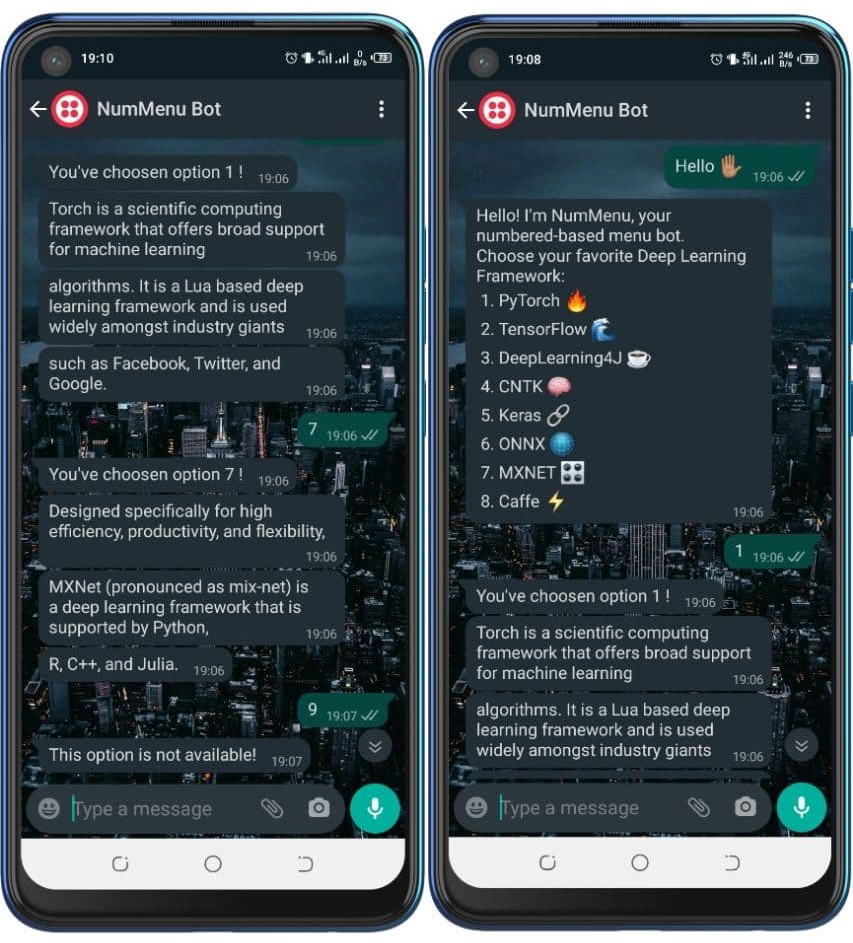

# NumMenu Bot

[](./LICENSE)


_NumMenu Bot_ is an example chatbot showing a way to design a number-based menu assistant with [Rasa](https://rasa.com/). This type of bot is very useful on platforms like [Whatsapp](https://rasa.com/docs/rasa/connectors/twilio/) where buttons may not render well.
The goal is to give some design ideas and the bot could be further optimized.  



<!-- START doctoc generated TOC please keep comment here to allow auto update -->
<!-- DON'T EDIT THIS SECTION, INSTEAD RE-RUN doctoc TO UPDATE -->
**Table Of Contents**

- [Install dependencies](#install-dependencies)
- [Run the bot](#run-the-bot)
- [Overview of the files](#overview-of-the-files)
- [Things you can ask the bot](#things-you-can-ask-the-bot)

<!-- END doctoc generated TOC please keep comment here to allow auto update -->


## Install dependencies

Run :
```bash
pip install -r requirements.txt
```

## Run the bot

Use `rasa train` to train a model. It is also possible to generate training data for scenarios (stories) by using [interactive learning](https://rasa.com/docs/rasa/writing-stories/#using-interactive-learning) with the command:
```
rasa interactive -m {path_to_a_model} 
```
> If there is no model already trained, you can remove the argument. Rasa will train the model with actual data.


Then, to run the bot, first set up your action server in one terminal window:
```bash
rasa run actions
```

In another window, you can talk to the bot by running:
```
rasa shell --debug  
```

It is also possible to do the two above with a single command:  
```
rasa run actions & rasa shell --debug  
```

> Note that `--debug` mode will produce a lot of output meant to help you understand how the bot is working under the hood. To simply talk to the bot, you can remove this flag.


## Overview of the files

`data/stories.yml` - contains [stories](https://rasa.com/docs/rasa/stories/)

`data/rules.yml` - contains [rules](https://rasa.com/docs/rasa/rules)

`data/nlu/` - contains [NLU training data](https://rasa.com/docs/rasa/nlu-training-data)

`actions/actions.py` - contains [custom action](https://rasa.com/docs/rasa/custom-actions)/api calls code

`domain.yml`         - the [domain](https://rasa.com/docs/rasa/domain) file, including bot response templates

`config.yml`         - training [configurations](https://rasa.com/docs/rasa/model-configuration) for the NLU pipeline and policy ensemble

## Things you can ask the bot

The bot is based on the [mood bot](https://github.com/RasaHQ/rasa/tree/main/examples/moodbot) to which has been added a menu that appears *when you greet it*. The menu offers a list of *Deep Learnig frameworks* and displays a small description of the chosen framework based on [this article](https://marutitech.com/top-8-deep-learning-frameworks/) from _Maruti TechLabs_.
From there, you can use the option numbers to choose a framework.

> The bot does not support a natural language formulation of any of the options. _Only the choice through numbers is supported_.


## Contributing

Feel free to make a PR or report an issue 😉️

